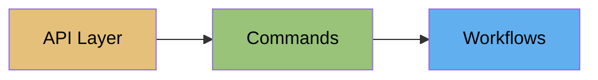

# Redis Cloud

Redis Cloud is Redis's fully managed database service. redisctl provides complete CLI access to the Redis Cloud API.

## Three-Tier Access



### 1. API Layer
Direct REST access for scripting and automation:
```bash
redisctl api cloud get /subscriptions
redisctl api cloud post /subscriptions -d @subscription.json
```

### 2. Commands
Human-friendly commands for day-to-day operations:
```bash
redisctl cloud subscription list
redisctl cloud database create --subscription 123 --data @db.json --wait
```

### 3. Workflows
Multi-step operations:
```bash
redisctl cloud workflow subscription-setup --name prod --region us-east-1
```

## Key Concepts

### Subscriptions

Subscriptions are the top-level container for databases. They define:

- Cloud provider (AWS, GCP, Azure)
- Region
- Memory allocation
- Networking configuration

### Databases

Databases run within subscriptions. Each database has:

- Memory limit
- Modules (RedisJSON, RediSearch, etc.)
- Persistence settings
- Access credentials

### Tasks

Most operations are async and return task IDs. Use `--wait` to block until completion.

## Authentication

=== "Environment Variables"

    ```bash
    export REDIS_CLOUD_API_KEY="your-key"
    export REDIS_CLOUD_SECRET_KEY="your-secret"
    ```

=== "Profile"

    ```bash
    redisctl profile set cloud \
      --cloud-api-key "your-key" \
      --cloud-secret-key "your-secret"
    ```

!!! tip "Getting API Keys"
    Get your API keys from [app.redislabs.com](https://app.redislabs.com) under **Access Management > API Keys**.

## Quick Examples

```bash
# List subscriptions
redisctl cloud subscription list -o table

# Create database and wait
redisctl cloud database create \
  --subscription 123456 \
  --name cache \
  --memory-limit-in-gb 1 \
  --wait

# Get database connection info
redisctl cloud database get 123456 789 \
  -o json -q '{endpoint: publicEndpoint, password: password}'

# Set up VPC peering
redisctl cloud vpc-peering create \
  --subscription 123456 \
  --data @peering.json \
  --wait
```

## Command Groups

<div class="grid cards" markdown>

-   :material-folder-multiple:{ .lg .middle } __Subscriptions__

    ---

    Create, list, update, and delete subscriptions

    [:octicons-arrow-right-24: Commands](commands/subscriptions.md)

-   :material-database:{ .lg .middle } __Databases__

    ---

    Manage databases within subscriptions

    [:octicons-arrow-right-24: Commands](commands/databases.md)

-   :material-account-lock:{ .lg .middle } __Access Control__

    ---

    Users, roles, and ACL rules

    [:octicons-arrow-right-24: Commands](commands/access-control.md)

-   :material-lan:{ .lg .middle } __Networking__

    ---

    VPC peering and private endpoints

    [:octicons-arrow-right-24: Commands](commands/networking.md)

-   :material-clipboard-list:{ .lg .middle } __Tasks__

    ---

    Monitor async operations

    [:octicons-arrow-right-24: Commands](commands/tasks.md)

</div>

## Next Steps

- [Workflows](workflows.md) - Multi-step operations
- [Cloud Cookbook](../cookbook/index.md) - Practical recipes
