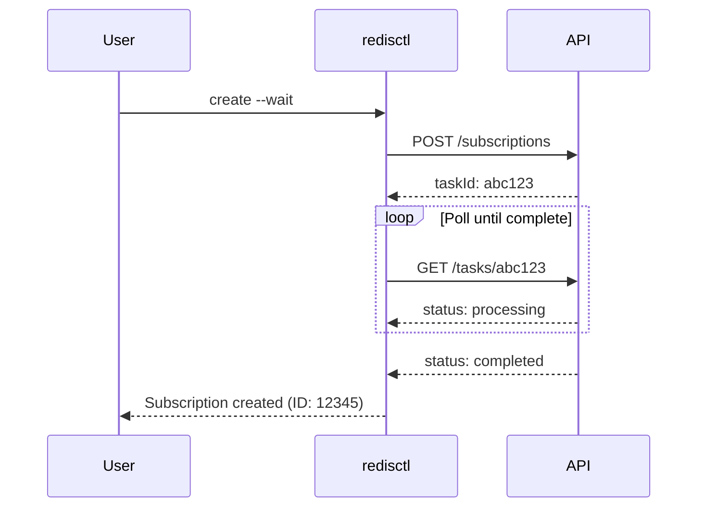

# Async Operations

Handle long-running operations without polling loops.

## The Problem

Many Redis API operations are asynchronous:

- Creating a subscription (1-5 minutes)
- Creating a database (30 seconds - 2 minutes)
- Scaling operations (varies)

Without redisctl, you'd write polling loops:

```bash
# The old way - don't do this
TASK_ID=$(curl ... | jq -r '.taskId')
while true; do
  STATUS=$(curl ... | jq -r '.status')
  if [ "$STATUS" = "completed" ]; then break; fi
  sleep 10
done
```

## The Solution: --wait

Add `--wait` to any create/update/delete command:

```bash
# Create and wait for completion
redisctl cloud subscription create \
  --name prod \
  --cloud-provider AWS \
  --region us-east-1 \
  --wait

# Returns only when the subscription is active
```

## How It Works



## Options

### Timeout

Set maximum wait time:

```bash
# Wait up to 10 minutes
redisctl cloud subscription create \
  --name prod \
  --wait \
  --wait-timeout 600
```

Default timeout varies by operation type.

### Poll Interval

Control how often to check status:

```bash
# Check every 5 seconds instead of default
redisctl cloud database create \
  --subscription-id 123 \
  --name mydb \
  --wait \
  --poll-interval 5
```

### No Wait (Fire and Forget)

Without `--wait`, commands return immediately with a task ID:

```bash
redisctl cloud subscription create --name prod --cloud-provider AWS --region us-east-1
```

```
Task created: abc123-def456
Use 'redisctl cloud task get abc123-def456' to check status
```

## Checking Task Status

### Get Task Details

```bash
redisctl cloud task get abc123-def456
```

### List Recent Tasks

```bash
redisctl cloud task list
```

### Wait for Existing Task

```bash
# Start waiting for a task that's already running
redisctl cloud task wait abc123-def456
```

## Scripting with Async

### Sequential Operations

```bash
# Create subscription, then database
SUB_ID=$(redisctl cloud subscription create \
  --name prod \
  --cloud-provider AWS \
  --region us-east-1 \
  --wait \
  -o json -q 'id')

redisctl cloud database create \
  --subscription-id "$SUB_ID" \
  --name cache \
  --memory-limit-in-gb 1 \
  --wait
```

### Parallel Operations

```bash
# Start multiple operations
redisctl cloud database create --subscription-id 123 --name db1 &
redisctl cloud database create --subscription-id 123 --name db2 &
redisctl cloud database create --subscription-id 123 --name db3 &

# Wait for all
wait
```

## CI/CD Example

```yaml
- name: Create database
  run: |
    redisctl cloud database create \
      --subscription-id ${{ vars.SUB_ID }} \
      --name "pr-${{ github.event.number }}" \
      --memory-limit-in-gb 1 \
      --wait \
      --wait-timeout 300 \
      -o json > database.json

    echo "REDIS_HOST=$(jq -r '.publicEndpoint' database.json)" >> $GITHUB_ENV
```

## Error Handling

If an async operation fails, `--wait` returns a non-zero exit code:

```bash
if ! redisctl cloud subscription create --name prod --wait; then
  echo "Subscription creation failed"
  exit 1
fi
```

The error message includes details from the API:

```
Error: Task failed: Insufficient quota for requested resources
```
