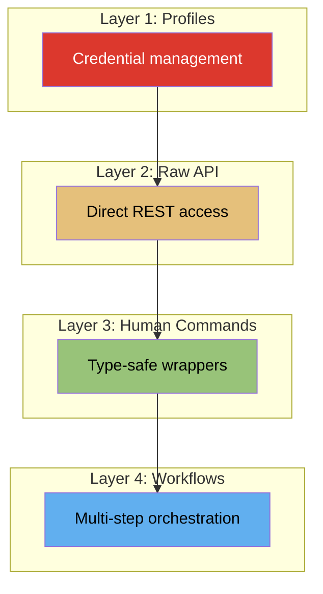

# Common Features

Features shared across Redis Cloud and Redis Enterprise commands.

## The Four Layers

redisctl is built around four layers of functionality:

| Layer | When to Use |
|-------|-------------|
| **Profiles** | Always - manage credentials across environments |
| **Raw API** | Exploring, debugging, or accessing undocumented endpoints |
| **Human Commands** | Day-to-day operations with friendly output |
| **Workflows** | Complex multi-step provisioning tasks |

## Features at a Glance

-   :material-account-key:{ .lg .middle } __Profiles__

    ---

    Manage credentials for multiple Redis deployments

    [:octicons-arrow-right-24: Learn more](profiles.md)

-   :material-code-json:{ .lg .middle } __Output Formats__

    ---

    JSON, YAML, or human-readable tables

    [:octicons-arrow-right-24: Learn more](output-formats.md)

-   :material-filter:{ .lg .middle } __JMESPath Queries__

    ---

    Filter and transform output with powerful queries

    [:octicons-arrow-right-24: Learn more](jmespath.md)

-   :material-sync:{ .lg .middle } __Async Operations__

    ---

    Wait for long-running operations to complete

    [:octicons-arrow-right-24: Learn more](async-operations.md)

-   :material-api:{ .lg .middle } __Raw API Access__

    ---

    Direct REST calls to any endpoint

    [:octicons-arrow-right-24: Learn more](raw-api.md)

