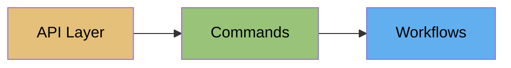

# Redis Enterprise

Redis Enterprise is Redis's self-managed database platform for on-premises or cloud deployments. redisctl provides complete CLI access to the REST API.

## Three-Tier Access



### 1. API Layer
Direct REST access for scripting and automation:
```bash
redisctl api enterprise get /v1/cluster
redisctl api enterprise post /v1/bdbs -d @database.json
```

### 2. Commands
Human-friendly commands for day-to-day operations:
```bash
redisctl cluster get                                      # prefix optional
redisctl database create --name mydb --memory-size 1073741824
```

### 3. Workflows
Multi-step operations:
```bash
redisctl enterprise workflow init-cluster --name prod --nodes 3
```

## Key Concepts

### Cluster

The cluster is the top-level container that spans multiple nodes. It manages:

- Node membership
- Resource allocation
- Policies and certificates
- License

### Nodes

Physical or virtual machines running Redis Enterprise. Each node provides:

- CPU and memory resources
- Network connectivity
- Storage for persistence

### Databases (BDBs)

Databases run across the cluster. Each database has:

- Memory allocation
- Sharding configuration
- Replication settings
- Modules (RedisJSON, RediSearch, etc.)

## Authentication

=== "Environment Variables"

    ```bash
    export REDIS_ENTERPRISE_URL="https://cluster.example.com:9443"
    export REDIS_ENTERPRISE_USER="admin@cluster.local"
    export REDIS_ENTERPRISE_PASSWORD="your-password"
    export REDIS_ENTERPRISE_INSECURE="true"  # for self-signed certs
    ```

=== "Profile"

    ```bash
    redisctl profile set enterprise --type enterprise \
      --url "https://cluster.example.com:9443" \
      --username "admin@cluster.local" \
      --password "your-password" \
      --insecure
    ```

!!! warning "Self-Signed Certificates"
    Most Enterprise clusters use self-signed certificates. Set `REDIS_ENTERPRISE_INSECURE=true` or use `--insecure` in profiles.

## Quick Examples

```bash
# Get cluster info (enterprise-only, prefix optional)
redisctl cluster get

# List databases
redisctl database list -o table

# Create database
redisctl database create \
  --name cache \
  --memory-size 1073741824

# Stream cluster stats
redisctl stats cluster --follow

# Generate support package
redisctl support-package cluster --upload
```

!!! tip "Prefix-free commands"
    The `enterprise` prefix is optional when your profile is an Enterprise profile. All examples above work with or without `redisctl enterprise ...`. See [Platform Inference](../common/profiles.md#platform-inference) for details.

## Command Groups

<div class="grid cards" markdown>

-   :material-server-network:{ .lg .middle } __Cluster__

    ---

    Cluster configuration and status

    [:octicons-arrow-right-24: Commands](commands/cluster.md)

-   :material-database:{ .lg .middle } __Databases__

    ---

    Create, configure, and manage databases

    [:octicons-arrow-right-24: Commands](commands/databases.md)

-   :material-server:{ .lg .middle } __Nodes__

    ---

    Node status and management

    [:octicons-arrow-right-24: Commands](commands/nodes.md)

-   :material-account-lock:{ .lg .middle } __Access Control__

    ---

    Users, roles, and LDAP configuration

    [:octicons-arrow-right-24: Commands](commands/access-control.md)

-   :material-chart-line:{ .lg .middle } __Monitoring__

    ---

    Stats, alerts, and logs

    [:octicons-arrow-right-24: Commands](commands/monitoring.md)

-   :material-earth:{ .lg .middle } __Active-Active__

    ---

    CRDB management

    [:octicons-arrow-right-24: Commands](commands/active-active.md)

</div>

## Operations

<div class="grid cards" markdown>

-   :material-package-variant:{ .lg .middle } __Support Package__

    ---

    Generate diagnostic packages for Redis Support

    [:octicons-arrow-right-24: Guide](operations/support-package.md)

-   :material-bug:{ .lg .middle } __Debug Info__

    ---

    Collect debugging information

    [:octicons-arrow-right-24: Guide](operations/debuginfo.md)

</div>

## Next Steps

- [Workflows](workflows.md) - Multi-step operations
- [Enterprise Cookbook](../cookbook/index.md) - Practical recipes
- [rladmin Comparison](../reference/rladmin.md) - If you're familiar with rladmin
